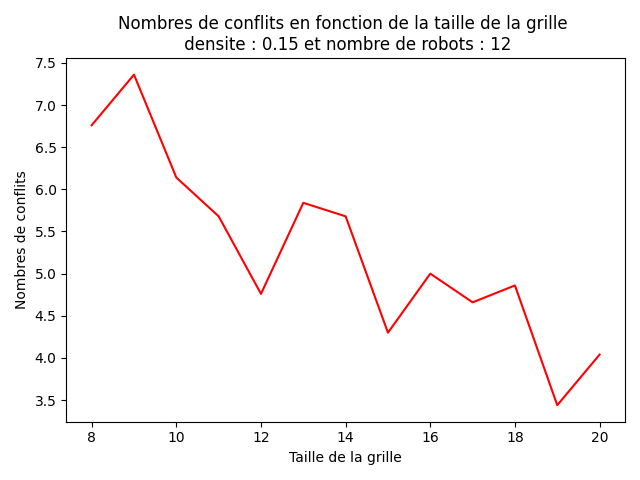
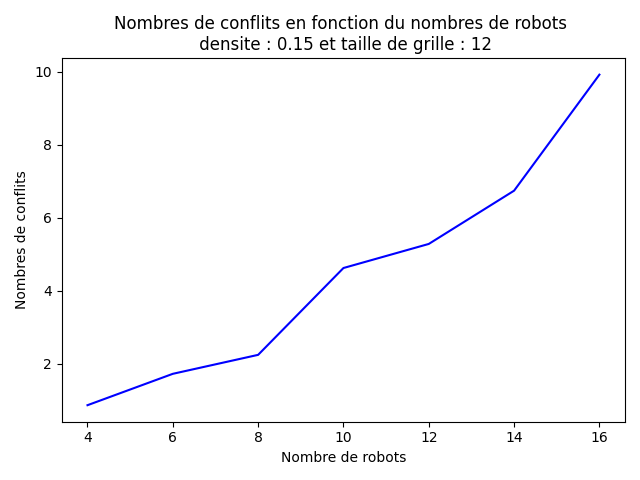
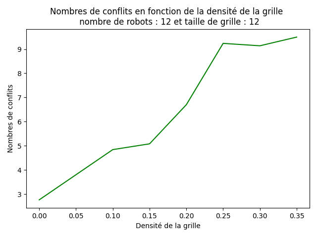

# DynaMAP---Dynamic-multi-agent-pathfinding
## Présentation
Le projet a pour objectif d'implémenter des algorithmes de pathfinding pour des agents placés sur un quadrillage. Les agents et leurs destinations sont placés au hasard sur une grille parsemé d'obstacles.  Les algorithmes (exemple : A*) doivent calculer le chemin optimal pour chaque agent jusqu'à sa destination. De plus, nôtre objectif est de supprimer les conflits entre agents : 
1. Les vertex conflicts : aucun agents ne doit se trouver au même moment sur la même position
2. Les edges conflicts : les agents ne doivent pas se croiser sur un même arc lorsqu'il échange de position

## Structure de données
* Classes
  * Robot : Implémente les  agents avec leurs positions actuelles, leurs spawns, leurs destination et le chemin suggéré par l'algorithme de pathfinding
  * Grille : Implémente le quadrillage sur lequel se trouvent les robots. Contient les robots et des fonctions qui permettent de connaître l'état de la grille. Par exemple, la fonction voisins permet aux robots de connaître les voisins possibles pour leurs prochain déplacement
  * Instance : Permet d'instancier une grille avec des agents. Plusieurs fonctions vont permettre de l'afficher, de l'animer et de dérouler les différents algorithmes

## Algorithmes
* BFS (Breadth-first search) : Algorithme d'exploration de graphe en largeur. Il nous permet de savoir si deux points peuvent être relier lorsqu'on calcule le spawn et la destination d'un agent. Cela évite de lui faire calculer un chemin impossible.
* Astar : Permet de calculer un des meilleurs chemin d'une coordonnées à une autre en un temps limité, il ne calcule pas le meilleur chemin mais l'un des meilleurs. Il repose sur une heuristique qui prend en compte le cout d'un chemin depuis le départ et la distance restante jusqu'à la destination
* AstarST : Variantes Spatio-temporel de Astar qui va permettre des supprimer les conflits via une planification séquentielle (un agent après l'autre), il prend en compte le facteur temps pour éviter que deux agents réserve la même position ou arrêtes aux même moment

## BenchMarks
### Evolution du nombres de conflits en fonction des variables d'instances
Nous avons plusieurs tests pour évaluer à quel point certaines variables avaient une influence sur le nombre de conflits

  
  
  

* Remarques
  * Plus il y a de robots, plus le nombres de conflits augmentent
  * Une densité de plus en plus élevé augmentent également le nombres de conflits
  * Une taille de grille de plus en plus grandes baissent le nombres de conflits. Cependant, cette baisse est moins marqué que lors des deux expériences précédentes
